# Общий алгоритм планировщика выполнения плагинов

Документ описывает алгоритм построения и выполнения плана плагинов: фазы, группы, порядок шагов, передачу контекста и пограничные случаи. Схемы выполнены в Mermaid (без окраски блоков).

---

## 1. Обзор

Планировщик состоит из двух этапов:

1. **Планирование (Planner.Plan)** — по имени команды и графу зависимостей строится упорядоченный список шагов (Plan).
2. **Выполнение (Executor.ExecuteWithPlan)** — шаги выполняются последовательно; выход одного шага передаётся как вход следующему; post-шаги получают специальный контекст.

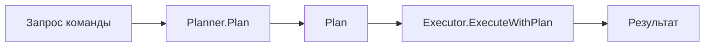

---

## 2. Типы плагинов (Kind)

| Kind | Описание | Когда выполняется |
|------|----------|-------------------|
| **pre** | Подготовка | До команды (в фазах preAlways или preChain). |
| **stage** | Промежуточный шаг | В stageChain; данные идут по конвейеру к команде. |
| **command** | Команда | Ровно один шаг в плане; центральный шаг. |
| **post** | Завершение | После команды (postChain или postAlways); получают lastStage + status + commandResponse. |

Определение kind (detectKind): если в установке задано поле `Kind` — используется оно; иначе при наличии `Commands` — `command`, иначе — `stage`.

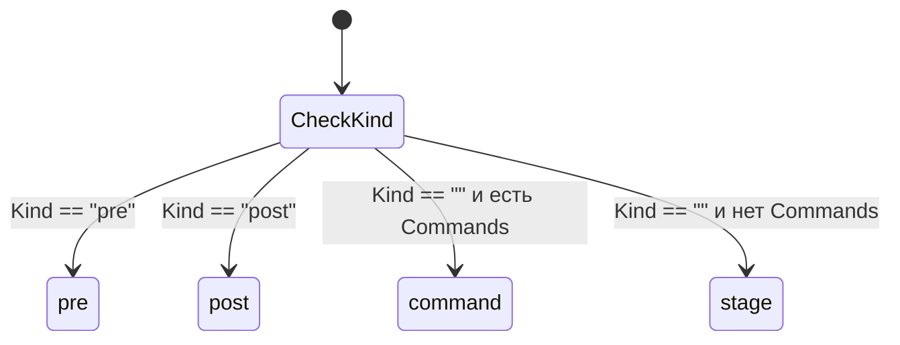

---

## 3. Алгоритм планирования (Plan)

### 3.1. Последовательность шагов Plan()

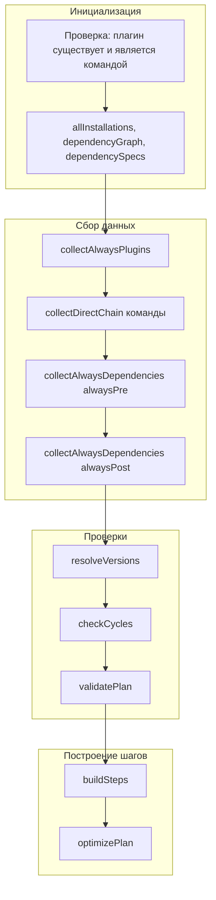

### 3.2. Сбор графа зависимостей

- **collectDirectChain(pluginName)** — рекурсивно обходит зависимости плагина; для каждого плагина парсит `Dependencies`, добавляет вершины и рёбра в `dependencyGraph` и записывает спецификации (имя@версия) в `dependencySpecs`. Транзитивные зависимости подтягиваются рекурсивно.
- **collectAlwaysPlugins()** — по списку установленных плагинов отбирает те, у которых `Always == true`; допускаются только kind pre или post; результат делится на `alwaysPre` и `alwaysPost`.
- **collectAlwaysDependencies** — для каждого always-pre и always-post вызывается `collectDirectChain`, чтобы их зависимости тоже попали в граф и в `allInstallations`.

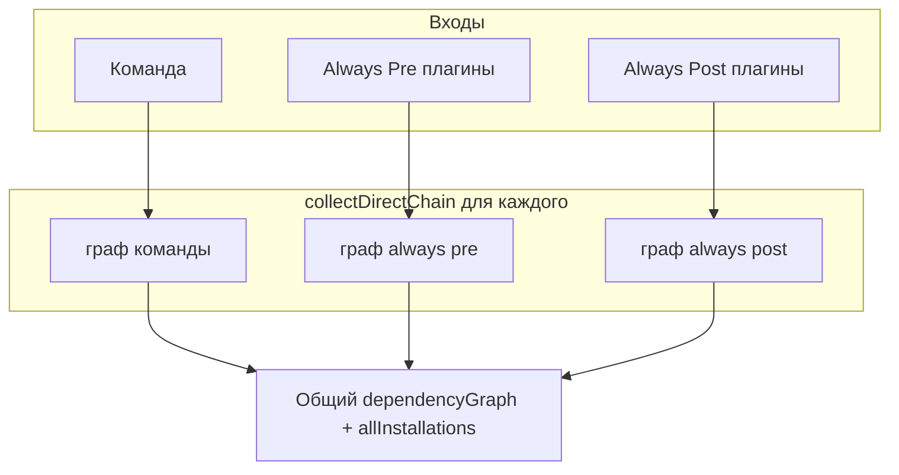

### 3.3. Множества для раскладки по фазам (buildSteps)

- **directChainSet** — команда и все её зависимости (рекурсивно по `dependencyGraph` через `collectDirectChainSet`).
- **alwaysPreSet** — каждый always-pre плагин + рекурсивно все его зависимости.
- **alwaysPostSet** — каждый always-post плагин + рекурсивно все его зависимости.

Один и тот же плагин может входить в несколько множеств (например, stage-плагин в цепочке команды и в цепочке always-pre).

### 3.4. Правило раскладки по фазам

Для каждого плагина (кроме команды) применяется первое сработавшее условие; внутри — по **собственному** kind:

| Условие | Kind Pre | Kind Stage | Kind Post |
|---------|----------|------------|-----------|
| **inDirectChain** | preChain | stageChain | postChain |
| **inAlwaysPre && !inDirectChain** | preAlways | stageChain | postChain |
| **inAlwaysPost && !inDirectChain** | preChain | stageChain | postAlways |

Итоговый порядок фаз (неизменный):

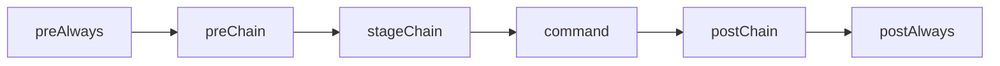

### 3.5. Топологическая сортировка внутри фаз

Внутри каждой фазы порядок плагинов задаётся **алгоритмом Кана** по графу зависимостей: учитываются только зависимости, входящие **в ту же группу**. Плагины с inDegree 0 в этой группе идут первыми; затем для каждого выполненного уменьшается inDegree у зависимых и в очередь добавляются новые с inDegree 0.

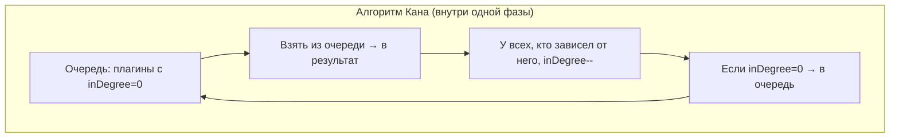

### 3.6. Оптимизация плана (optimizePlan)

После сборки списка шагов вызывается **optimizePlan**: удаляются дубликаты **по имени плагина** (`step.Name`). Остаётся только **первое** по порядку вхождение шага с данным именем; все последующие шаги с тем же именем (в том числе с другой версией) отбрасываются. В плане для одного имени плагина всегда не более одного шага.

---

## 4. Алгоритм выполнения (ExecuteWithPlan)

### 4.1. Разбиение плана на три части

- **preStageSteps** — все шаги до шага команды с kind ≠ post (т.е. pre и stage).
- **commandStep** — единственный шаг с `Kind == KindCommand`.
- **postSteps** — все шаги с `Kind == KindPost` (в порядке появления в плане).

Если шага команды нет — возвращается ошибка.

### 4.2. Конвейер pre/stage и команда

- Начальный контекст: `plan.InitialRequest` (или пустое хранилище).
- Каждый шаг из preStageSteps выполняется с текущим `currentRequest`; ответ становится новым `currentRequest` для следующего.
- Ответ последнего **stage** сохраняется в `lastStageResponse` (для post).
- Команда выполняется с тем же `currentRequest`; ошибка команды не прерывает выполнение — сохраняются `commandStatus` (success/error) и `commandResponse`.

### 4.3. Post-шаги

- Вход для **всех** post-шагов формируется один раз: **postRequest = buildPostRequest(lastStageResponse, commandStatus, commandResponse)** — объединение последнего stage, статуса команды и ответа команды.
- Post-шаги выполняются по очереди; выход каждого становится входом следующего.
- После всех post, если команда завершилась с ошибкой, эта ошибка возвращается вызывающему.

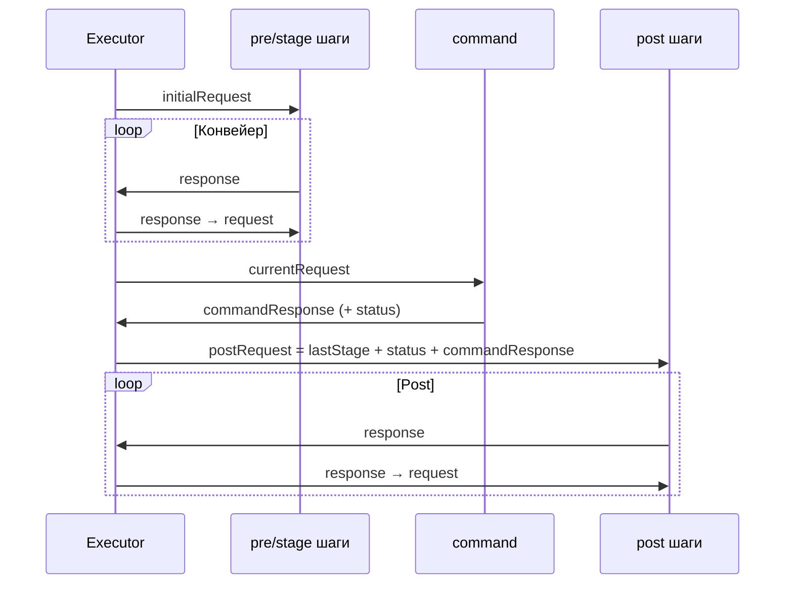

---

## 5. Кейсы и примеры

### 5.1. Команда без зависимостей

- **Условие:** команда `run`, зависимостей нет; always-плагинов нет.
- **Граф:** `run → []`.
- **Множества:** directChainSet = {run}, alwaysPreSet = ∅, alwaysPostSet = ∅.
- **Группы:** все пустые, кроме command.
- **План:** один шаг — `run`.
- **Выполнение:** initialRequest → run → конец; post-шагов нет.

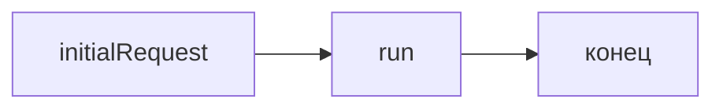

### 5.2. Команда с цепочкой pre → stage

- **Условие:** команда `gen` зависит от stage `ast`, stage без зависимостей.
- **Граф:** `gen → [ast]`, `ast → []`.
- **directChainSet:** {gen, ast}. ast → stageChain, команда → command.
- **Порядок:** ast → gen.

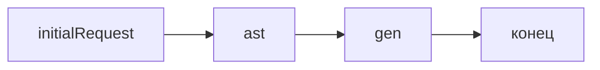

### 5.3. Always pre и always post без зависимостей

- **Условие:** always pre `auth`, always post `telemetry`; команда `run`.
- **alwaysPreSet:** {auth}, alwaysPostSet: {telemetry}.
- **План:** auth → run → telemetry.
- **Контекст post:** postRequest = lastStage (здесь = initialRequest) + status + commandResponse.

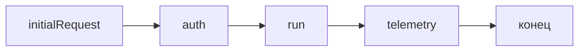

### 5.4. Pre-плагин зависит от stage; команда зависит от того же stage (пограничный случай)

- **Условие:** команда `generate` → `astg` (stage). Always pre `search` → `astg`. Always pre `auth`, always post `telemetry`.
- **Граф:** generate→[astg], search→[astg], astg→[], auth→[], telemetry→[].
- **directChainSet:** {generate, astg}. **alwaysPreSet:** {auth, search, astg} (search и его зависимость astg).
- **Раскладка:** astg входит в directChain → **stageChain**. auth, search в alwaysPre, не в directChain → **preAlways** (оба pre). telemetry → **postAlways**.
- **Порядок:** preAlways (auth, search) → stageChain (astg) → command (generate) → postAlways (telemetry).

Важно: **search выполняется до astg**, хотя search объявлен как зависимый от astg. Топологическая сортировка действует только внутри фазы; astg в другой фазе (stageChain), поэтому порядок зависимость→зависимый не достигается. Это ограничение текущей модели.

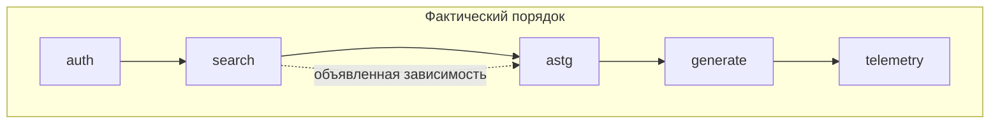

### 5.5. Зависимости внутри одной фазы (топологический порядок)

- **Условие:** preChain: плагины `a`, `b`, `c`; `b` зависит от `a`, `c` зависит от `b`.
- **Граф в группе:** a→[], b→[a], c→[b].
- **Топологическая сортировка:** a (inDegree 0), затем b, затем c.
- **Порядок:** a → b → c.

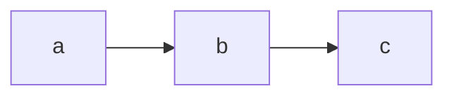

### 5.6. Дедупликация шагов (optimizePlan)

- **Ключ:** только `step.Name` (версия не учитывается).
- **Поведение:** остаётся первое по порядку вхождение шага с данным именем; последующие с тем же именем отбрасываются.
- **Один плагин — один шаг:** один и тот же плагин с разными версиями (например, `foo@1.0` и `foo@2.0`) после оптимизации будет представлен в плане **одним** шагом — тем, который встретился первым.

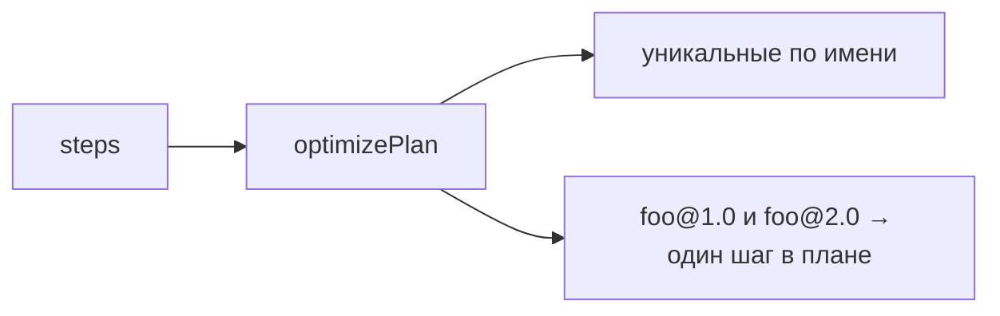

### 5.7. Циклические зависимости (ошибка)

- **Условие:** A → B → C → A.
- **Проверка:** checkCycles обходит граф DFS с recStack; при входе в вершину, уже находящуюся в текущем пути, фиксируется цикл.
- **Результат:** ошибка, план не строится; в сообщении выводится путь цикла (например, "A -> B -> C -> A").

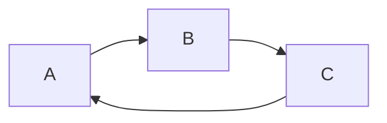

### 5.8. Зависимость от команды (ошибка)

- **Условие:** плагин `hook` (pre) в зависимостях указывает команду `run`.
- **Проверка:** validatePlan для каждой зависимости плагина проверяет, что зависимость не имеет kind command.
- **Результат:** ошибка «plugin hook cannot depend on command run: commands cannot be dependencies of other plugins».

### 5.9. В плане не ровно одна команда (ошибка)

- **Условие:** в allInstallations два плагина с kind command (невозможно при корректной конфигурации: команда одна — запрошенная).
- **Проверка:** validatePlan считает commandCount; если ≠ 1 — ошибка «plan must contain exactly one command, found N».

### 5.10. Always с kind stage (ошибка)

- **Условие:** плагин с `Always == true` и kind = stage (или command).
- **Проверка:** collectAlwaysPlugins и validatePlan допускают always только для pre и post.
- **Результат:** ошибка «plugin X has always=true but kind is stage: always can only be used with pre or post plugins».

### 5.11. Несовместимая версия зависимости (ошибка)

- **Условие:** плагин требует зависимость `foo@^1.0`, установлена `foo@0.9`.
- **Проверка:** resolveVersions для каждой спецификации с версией вызывает isVersionCompatible(installed, required).
- **Результат:** ошибка с указанием плагина, зависимости и требуемой версии.

### 5.12. Отсутствующая зависимость (ошибка)

- **Условие:** в графе указана зависимость `bar`, плагин `bar` не установлен.
- **Проверка:** resolveVersions вызывает loader.GetInfo(depName); при ошибке — зависимость не установлена.
- **Результат:** ошибка «dependency bar of plugin X is not installed, install it via plugin install command».

### 5.13. Пустые группы

- **Условие:** нет always-плагинов, команда без зависимостей.
- **Группы:** preAlways, preChain, stageChain, postChain, postAlways — пустые. В плане только шаг команды.
- **Выполнение:** один шаг; lastStageResponse = initialRequest; post-шагов нет, postRequest не строится.

### 5.14. Ошибка команды и выполнение post

- **Условие:** команда завершилась с ошибкой.
- **Поведение:** commandStatus = "error", commandResponse может быть nil или частичным. Post-шаги всё равно получают postRequest (lastStage + status + commandResponse) и выполняются. После выполнения всех post вызывающему возвращается ошибка команды.

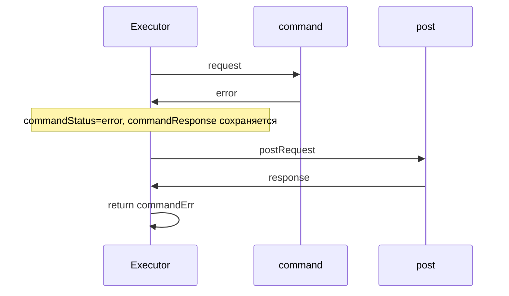

### 5.15. Отмена по контексту

- **Условие:** e.ctx отменён (например, Cancel) до или во время выполнения шага.
- **Поведение:** перед каждым шагом выполняется select по e.ctx.Done(); при отмене возвращается ошибка «execution cancelled: context canceled» (или причина отмены).

---

## 6. Сводные схемы

### 6.1. Полный поток от запроса до выполнения

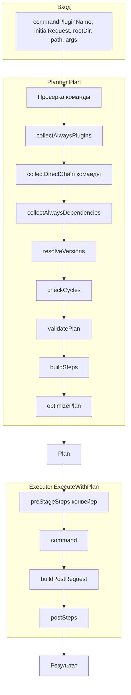

### 6.2. Матрица: множество × kind → фаза

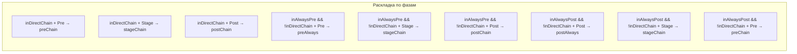

### 6.3. Карта кейсов (mindmap)

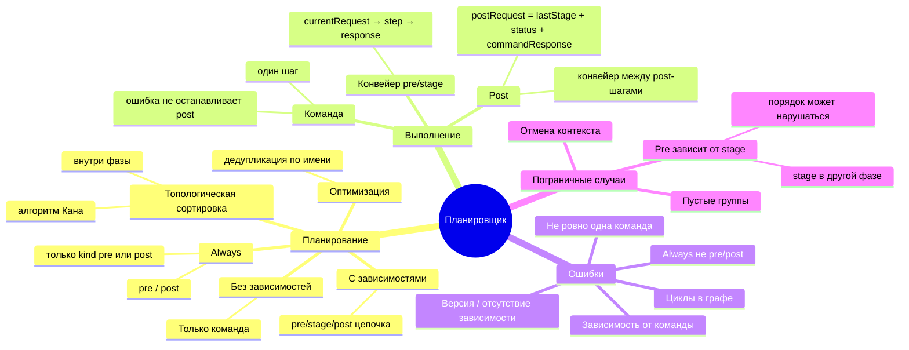

---

## 7. Краткий итог

- **План** строится в порядке фаз: preAlways → preChain → stageChain → command → postChain → postAlways; внутри каждой фазы порядок задаётся топологической сортировкой по графу зависимостей (только внутри группы).
- **Выполнение** — последовательный конвейер для pre/stage, один шаг команды, затем post с единым postRequest (lastStage + commandStatus + commandResponse).
- **Пограничные случаи:** циклы и невалидные зависимости приводят к ошибке на этапе Plan; pre-плагин, зависящий от stage, может выполниться до этого stage, если stage в более поздней фазе; дубликаты шагов убираются по имени плагина (без учёта версии); ошибка команды не отменяет выполнение post, но итоговая ошибка для вызывающего — ошибка команды.
